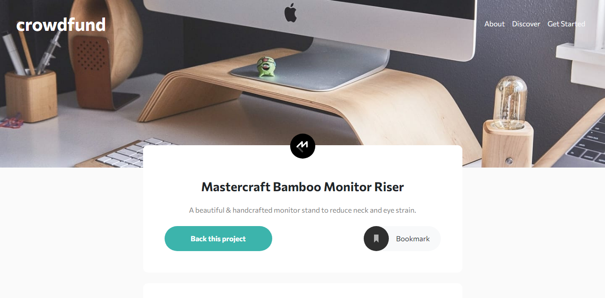
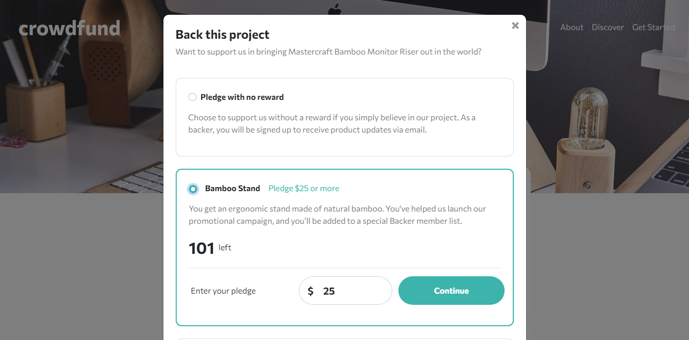
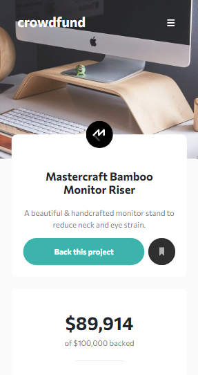
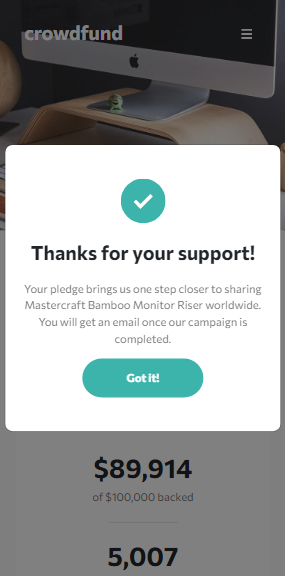

# Frontend Mentor - Crowdfunding product page solution

This is a solution to the [Crowdfunding product page challenge on Frontend Mentor](https://www.frontendmentor.io/challenges/crowdfunding-product-page-7uvcZe7ZR). Frontend Mentor challenges help you improve your coding skills by building realistic projects. 

## Table of contents

- [Overview](#overview)
  - [The challenge](#the-challenge)
  - [Screenshot](#screenshot)
  - [Links](#links)
- [My process](#my-process)
  - [Built with](#built-with)
- [Author](#author)

## Overview

### The challenge

Users should be able to:

- View the optimal layout depending on their device's screen size
- See hover states for interactive elements
- Make a selection of which pledge to make
- See an updated progress bar and total money raised based on their pledge total after confirming a pledge
- See the number of total backers increment by one after confirming a pledge
- Toggle whether or not the product is bookmarked

### Screenshot

### Links

- Solution URL: [https://www.frontendmentor.io/solutions/crowdfunding-page-using-bootstrap-js-ClsbxDODG](https://www.frontendmentor.io/solutions/crowdfunding-page-using-bootstrap-js-ClsbxDODG)
- Live Site URL: [https://iqbl-nrkhls.github.io/crowdfunding-page/](https://iqbl-nrkhls.github.io/crowdfunding-page/)

## My process

### Built with

- Semantic HTML5 markup
- SCSS
- Flexbox
- Mobile-first workflow
- Bootstrap 5

## Author

- GitHub - [iqbl-nrkhls](https://github.com/iqbl-nrkhls)
- Frontend Mentor - [@iqbl-nrkhls](https://www.frontendmentor.io/profile/iqbl-nrkhls)
- Twitter - [@iqbal_nurkholis](https://www.twitter.com/iqbal_nurkholis)
